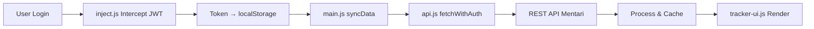

<div align="center">

# 🛰️ SITREK Mentari


**Sistem Pelacakan & Produktivitas Akademik Otomatis untuk Mentari UNPAM**

[](https://github.com/ardians45/sitrek-mentari/releases)
[](https://developer.chrome.com/docs/extensions/mv3/)
[](LICENSE)
[](https://mentari.unpam.ac.id)

<br/>

Ekstensi browser yang menyediakan **pelacakan progres forum otomatis**, **monitoring presensi**, **ringkasan WhatsApp**, dan berbagai **alat produktivitas** untuk mahasiswa Universitas Pamulang yang menggunakan portal e-learning Mentari.

[Instalasi](#-instalasi) · [Cara Penggunaan](#-cara-penggunaan) · [Fitur](#-fitur-utama) · [Arsitektur](#%EF%B8%8F-arsitektur-teknis) · [Kontribusi](#-kontribusi)

</div>

---

## 📋 Daftar Isi

- [Fitur Utama](#-fitur-utama)
- [Screenshots](#-screenshots)
- [Tech Stack](#-tech-stack)
- [Prasyarat](#-prasyarat)
- [Instalasi](#-instalasi)
- [Cara Penggunaan](#-cara-penggunaan)
- [Arsitektur Teknis](#%EF%B8%8F-arsitektur-teknis)
- [Struktur Proyek](#-struktur-proyek)
- [Keamanan & Privasi](#-keamanan--privasi)
- [Troubleshooting](#-troubleshooting)
- [FAQ](#-faq)
- [Kontribusi](#-kontribusi)
- [Lisensi](#-lisensi)

---

## 🌟 Fitur Utama

### 📊 Forum Progress Tracker
Dashboard utama yang menampilkan progres forum diskusi dari semua mata kuliah secara real-time.

| Status | Keterangan |
|--------|------------|
| 🟢 `DONE` | Forum telah dikerjakan dan diselesaikan |
| 🟠 `WAIT` | Forum aktif/terbuka yang belum dikerjakan |
| ⚪ `LOCKED` | Forum belum tersedia / belum dibuka dosen |
| ∅ `EMPTY` | Pertemuan tanpa komponen forum diskusi |

- **Navigasi sekali klik** — Langsung menuju halaman forum dari dashboard
- **Sorting by hari** — Mata kuliah diurutkan otomatis berdasarkan hari (Senin → Minggu)
- **Indikator persentase** — Progress bar dan persentase per mata kuliah
- **Auto-hide completed** — Forum yang sudah selesai disembunyikan otomatis

### 👥 Daftar Mahasiswa
Lihat rekan sekelas dalam satu klik.

- **Nomor absen otomatis** — Nama diurutkan secara alfabet (A-Z) dengan nomor urut
- **NIM** — Menampilkan Nomor Induk Mahasiswa
- **Jumlah total** — Badge counter jumlah mahasiswa terdaftar

### 🔔 Notifikasi Forum
Pantau interaksi dosen dan rekan di forum diskusi.

- **Deteksi balasan dosen** — Notifikasi otomatis saat dosen membalas postingan Anda
- **Deteksi balasan mahasiswa** — Tahu kapan ada diskusi baru yang relevan
- **Link langsung** — Klik notifikasi untuk langsung ke forum terkait

### 📱 WhatsApp Summary Generator
Buat dan bagikan rekap mingguan ke grup kelas melalui WhatsApp.

- **Deteksi pekan otomatis** — Menentukan pekan aktif berdasarkan mayoritas data
- **Pengelompokan online/offline** — Otomatis memisahkan kelas tatap muka dan daring
- **Format siap kirim** — Teks langsung diarahkan ke WhatsApp Web/App

### 📋 Presensi Viewer
Dashboard rekapitulasi kehadiran yang komprehensif.

- **Data per mata kuliah** — Lihat kehadiran per pertemuan per matkul
- **Ringkasan kehadiran** — Persentase hadir, izin, alfa
- **Integrasi my.unpam.ac.id** — Mengambil data langsung dari portal presensi UNPAM

### ⚡ Alat Produktivitas

| Fitur | Deskripsi |
|-------|-----------|
| **Quick Survey** | Otomasi pengisian kuisioner dosen di halaman KHS dengan rating 1-5 bintang |
| **Auto-Fill Kuesioner** | Klik otomatis radio button evaluasi dosen dan submit |
| **Smart Login** | Generate password default dari NIM dan custom background login page |
| **Gemini AI Chatbot** | AI assistant berbasis Google Gemini untuk membantu belajar |
| **Version Checker** | Cek update versi terbaru langsung dari GitHub Releases |

---

## 📸 Screenshots

> Antarmuka menggunakan desain **Neo Brutalism** — bold borders, vibrant colors, dan layout yang tegas.

<!-- Tambahkan screenshot di sini -->
<!--  -->
<!--  -->

---

## 🔧 Tech Stack

| Layer | Teknologi | Keterangan |
|-------|-----------|------------|
| **Runtime** | Chrome Extension Manifest V3 | API terbaru untuk ekstensi browser modern |
| **Bahasa** | JavaScript (ES6+ Modules) | `import/export`, `async/await`, template literals |
| **UI Framework** | Vanilla CSS + Injected DOM | Neo Brutalism design system, CSS Custom Properties |
| **Font** | Plus Jakarta Sans, JetBrains Mono | Google Fonts, dimuat via `@import` |
| **AI** | Google Gemini 2.0 Flash | Ringkasan diskusi, draft jawaban, chatbot |
| **Storage** | localStorage API | State management terpusat via `storage.js` |
| **Auth** | JWT Token Interception | Override `fetch()` dan `XMLHttpRequest` untuk menangkap Bearer token |
| **API** | REST API Mentari + my.unpam.ac.id | Endpoint untuk courses, forum, presensi |
| **Version Control** | Git + GitHub | Hosting dan distribusi rilis |

---

## 📦 Prasyarat

- **Browser**: Google Chrome (v88+) atau Microsoft Edge (v88+) yang mendukung Manifest V3
- **Akun**: Mahasiswa aktif Universitas Pamulang dengan akses ke [mentari.unpam.ac.id](https://mentari.unpam.ac.id)
- **Opsional**: API Key Google Gemini untuk fitur AI (gratis di [aistudio.google.com](https://aistudio.google.com))

---

## 🚀 Instalasi

### Metode 1: Clone dari GitHub (Direkomendasikan)

```bash
git clone https://github.com/ardians45/sitrek-mentari.git
```

### Metode 2: Download ZIP

Unduh dari halaman [Releases](https://github.com/ardians45/sitrek-mentari/releases) dan ekstrak.

### Load ke Browser

1. Buka halaman ekstensi:
   - **Chrome**: `chrome://extensions/`
   - **Edge**: `edge://extensions/`
2. Aktifkan **Developer Mode** (toggle di pojok kanan atas)
3. Klik **Load unpacked**
4. Pilih folder `sitrek-mentari` yang telah di-clone/diekstrak
5. ✅ Ekstensi siap digunakan!

---

## 📖 Cara Penggunaan

### Langkah Awal

1. **Login** ke portal [mentari.unpam.ac.id](https://mentari.unpam.ac.id) atau [my.unpam.ac.id](https://my.unpam.ac.id)
2. Ekstensi akan **otomatis aktif** dan menampilkan panel SITREK di pojok layar
3. Klik tombol **Refresh** (🔄) untuk sinkronisasi data pertama kali

### Navigasi Tab

| Tab | Fungsi |
|-----|--------|
| **Forum** | Dashboard progres forum diskusi semua mata kuliah |
| **Mahasiswa** | Daftar rekan sekelas diurutkan berdasarkan abjad dengan nomor absen |
| **Notifikasi** | Daftar balasan baru dari dosen dan mahasiswa lain |

### Fitur Utama

| Aksi | Cara |
|------|------|
| Sinkronisasi data | Klik tombol 🔄 pada header panel |
| Buka forum langsung | Klik pada *pill* forum (`P1`, `P2`, dst.) |
| Collapse/expand panel | Klik pada header panel atau tombol ⬆️ |
| Kirim ringkasan WA | Klik tombol **Summary** di status bar |
| Lihat presensi | Klik link **Lihat Presensi** di tab Forum |

### Pengaturan

Akses melalui panel **Token Runner** (muncul otomatis):

- **Gemini AI Toggle** — Aktifkan/nonaktifkan AI chatbot
- **Update API Key** — Masukkan atau perbarui Gemini API key
- **Cek Update** — Periksa versi terbaru dari GitHub

---

## 🏗️ Arsitektur Teknis

```
┌─────────────────────────────────────────────────────────┐
│                    Browser (Chrome/Edge)                 │
├──────────────┬────────────────────────┬─────────────────┤
│  Popup       │   Content Scripts      │   Web Page      │
│  (popup/)    │   (scripts/loader.js)  │   (Mentari)     │
│              │          │             │                 │
│  ┌────────┐  │   ┌──────▼──────┐      │  ┌───────────┐ │
│  │popup   │  │   │ inject.js   │──────┼──│ fetch()   │ │
│  │.html   │  │   │ (intercept) │      │  │ XHR       │ │
│  │script  │──┼──▶│             │      │  │ localStorage│
│  │.js     │  │   └──────┬──────┘      │  └───────────┘ │
│  └────────┘  │   ┌──────▼──────┐      │                │
│              │   │ main.js     │      │                │
│              │   │ (orchestor) │      │                │
│              │   └──────┬──────┘      │                │
│              │   ┌──────▼──────┐      │                │
│              │   │ tracker-ui  │      │                │
│              │   │ (DOM inject)│      │                │
│              │   └─────────────┘      │                │
├──────────────┴────────────────────────┴─────────────────┤
│                    External APIs                        │
│  mentari.unpam.ac.id/api/*  │  my.unpam.ac.id/api/*    │
│  generativelanguage.googleapis.com (Gemini)             │
└─────────────────────────────────────────────────────────┘
```

### Alur Data



---

## 📁 Struktur Proyek

```
sitrek-mentari/
├── manifest.json              # Konfigurasi ekstensi (Manifest V3)
├── README.md                  # Dokumentasi
├── LICENSE                    # MIT License
│
├── assets/
│   └── icon.png               # Ikon ekstensi (16, 48, 128px)
│
├── popup/
│   ├── popup.html             # UI popup ekstensi
│   └── script.js              # Logic popup (trigger token runner)
│
├── src/
│   ├── core/
│   │   ├── api.js             # HTTP client dengan Bearer auth
│   │   ├── inject.js          # Script injection ke halaman web
│   │   ├── interceptor.js     # Override fetch/XHR untuk capture token
│   │   ├── gemini.js          # Integrasi Google Gemini AI
│   │   └── storage.js         # Abstraksi localStorage + STORAGE_KEYS
│   │
│   ├── components/
│   │   └── tracker-ui.js      # UI utama (Neo Brutalism design)
│   │
│   └── content/
│       └── main.js            # Entry point, orchestrator, WA summary
│
└── scripts/
    ├── loader.js              # Bootstrap: inject.js + main.js
    ├── content.js             # Auto-load token.js + apiKeyManager.js
    ├── token.js               # Token Runner UI + full course detail viewer
    ├── apiKeyManager.js       # Manajemen API key Gemini
    ├── gemini.js              # Gemini AI chatbot interface
    ├── presensi.js            # Dashboard rekapitulasi kehadiran
    ├── QuickSurvey.js         # Otomasi survey/kuisioner KHS
    ├── kuisioner.js           # Auto-click evaluasi dosen
    ├── pw.js                  # Smart login (auto-fill password)
    ├── home.js                # Kustomisasi halaman beranda Mentari
    └── discus.js              # Placeholder (fitur diskusi deprecated)
```

---

## 🔒 Keamanan & Privasi

| Aspek | Implementasi |
|-------|--------------|
| **Kredensial** | ❌ Tidak pernah menyimpan username/password |
| **Token** | ✅ Hanya menggunakan JWT session token yang sudah ada di browser |
| **Data** | ✅ Semua data disimpan di `localStorage` browser lokal — tidak dikirim ke server eksternal |
| **Permissions** | Minimal: `storage`, `activeTab`, `scripting` |
| **Host Access** | Hanya `mentari.unpam.ac.id` dan `my.unpam.ac.id` |
| **AI (Opsional)** | API call ke Gemini dilakukan langsung dari browser user, tanpa proxy |

> [!IMPORTANT]
> Ekstensi ini **tidak** mengumpulkan, mengirim, atau menyimpan data pribadi ke server manapun. Seluruh operasi berjalan secara lokal di browser Anda.

---

## 🔧 Troubleshooting

| Masalah | Solusi |
|---------|--------|
| Data tidak muncul setelah sync | Pastikan Anda sudah login di Mentari, lalu klik Refresh |
| Token tidak terdeteksi | Refresh (F5) halaman Mentari, lalu klik tombol Refresh di panel |
| Panel tidak muncul | Pastikan Developer Mode aktif dan ekstensi ter-load di `chrome://extensions` |
| Gemini AI tidak merespons | Periksa API key melalui tombol "Update API Key" di panel Token Runner |
| Quick Survey tidak muncul | Pastikan Anda berada di halaman `my.unpam.ac.id/data-akademik/khs` |
| Presensi gagal dimuat | Pastikan Anda juga login di `my.unpam.ac.id` |

---

## ❓ FAQ

<details>
<summary><strong>Apakah data login saya aman?</strong></summary>

Ya. SITREK tidak pernah menyentuh kredensial login Anda. Ekstensi hanya membaca JWT token yang sudah ada di session browser Anda untuk berkomunikasi dengan API Mentari secara lokal.
</details>

<details>
<summary><strong>Bagaimana cara memperbarui data?</strong></summary>

Klik ikon Refresh (🔄) pada header panel SITREK. Data akan disinkronkan ulang dari API Mentari. Data juga di-cache di localStorage sehingga tetap tampil saat Anda kembali membuka halaman.
</details>

<details>
<summary><strong>Apakah ekstensi ini gratis?</strong></summary>

Ya, sepenuhnya gratis dan open-source di bawah lisensi MIT. Anda bebas menggunakan, memodifikasi, dan mendistribusikannya.
</details>

<details>
<summary><strong>Bagaimana cara mengaktifkan fitur AI?</strong></summary>

1. Dapatkan API key gratis dari [Google AI Studio](https://aistudio.google.com)
2. Buka panel Token Runner di halaman Mentari
3. Klik "Update API Key" dan masukkan key Anda
4. Aktifkan toggle "Gemini AI"
</details>

<details>
<summary><strong>Apakah bisa digunakan di browser lain selain Chrome?</strong></summary>

Ya, ekstensi ini kompatibel dengan semua browser berbasis Chromium yang mendukung Manifest V3, termasuk Microsoft Edge, Brave, dan Opera.
</details>

---

## 🤝 Kontribusi

Kontribusi sangat diterima! Berikut cara berkontribusi:

1. **Fork** repositori ini
2. **Clone** fork Anda:
   ```bash
   git clone https://github.com/<username>/sitrek-mentari.git
   ```
3. Buat **branch** baru:
   ```bash
   git checkout -b feature/nama-fitur
   ```
4. **Commit** perubahan Anda:
   ```bash
   git commit -m "feat: deskripsi singkat perubahan"
   ```
5. **Push** ke branch:
   ```bash
   git push origin feature/nama-fitur
   ```
6. Buat **Pull Request**

### Commit Convention

| Prefix | Keterangan |
|--------|------------|
| `feat:` | Fitur baru |
| `fix:` | Perbaikan bug |
| `docs:` | Perubahan dokumentasi |
| `style:` | Perubahan styling/UI |
| `refactor:` | Refactor kode tanpa perubahan fitur |
| `chore:` | Maintenance, dependency, dll |

---

## 📄 Lisensi

Proyek ini dilisensikan di bawah [MIT License](LICENSE).

```
MIT License — Copyright (c) 2025 Asterix Studio
```

---

<div align="center">

**SITREK Mentari** — Dibuat untuk mempermudah produktivitas mahasiswa Universitas Pamulang.

Built with ❤️ by **Asterix Studio** · 2025 - 2026

[⬆ Kembali ke Atas](#%EF%B8%8F-sitrek-mentari)

</div>
